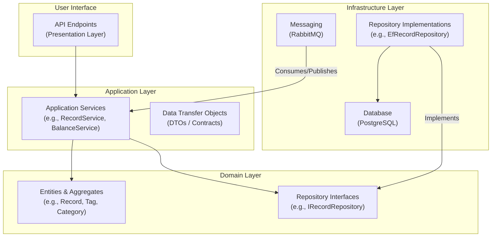
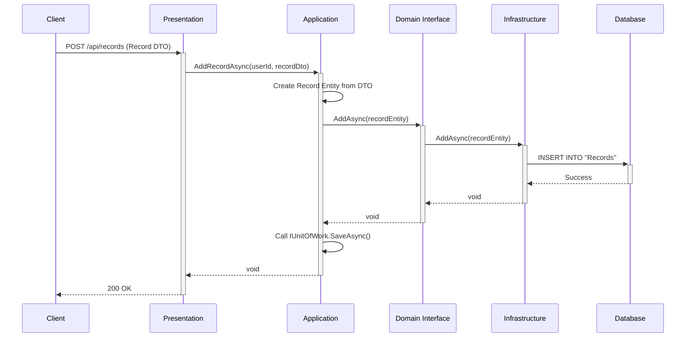
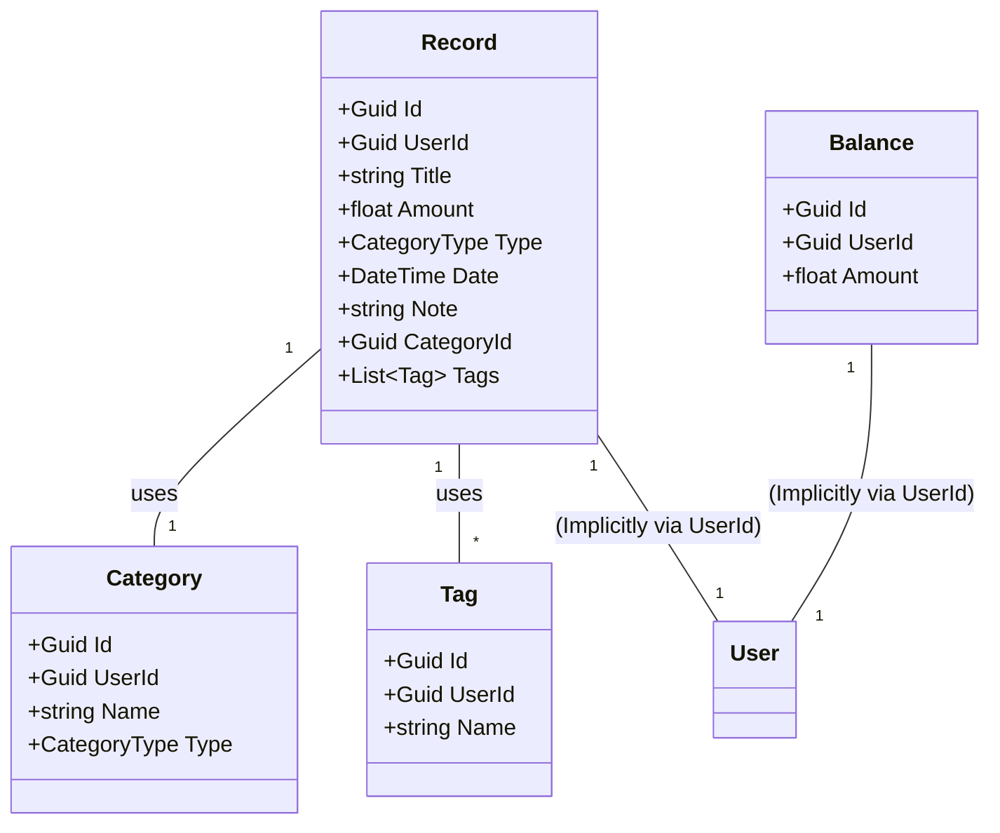

# SmartFlowBackend

SmartFlow 是一個個人財務管理應用程式，旨在提供一個易於操作的系統來追蹤支出、收入和預算。

此專案採用領域驅動設計（Domain-Driven Design, DDD）的分層架構，確保業務邏輯的獨立性與系統的長期健康。

## ✨ 技術棧 (Tech Stack)

- **Framework**: .NET 8 / ASP.NET Core
- **Database**: PostgreSQL
- **ORM**: Entity Framework Core
- **Messaging**: RabbitMQ (用於異步處理，例如使用者註冊後的初始化)
- **Containerization**: Docker / Docker Compose
- **Architecture**: Domain-Driven Design (DDD)

## 🏛️ 專案架構 (Architecture)

本專案遵循 DDD 的分層架構，將系統劃分為四個主要層次：`Presentation`, `Application`, `Domain`, 和 `Infrastructure`。

### 1. High-Level Architecture

此圖展示了系統的總體分層結構，所有依賴關係都指向核心的 `Domain` 層。



### 2. Request Flow (Sequence Diagram)

此時序圖描述了「新增一筆消費紀錄」的 API 請求在系統內部的完整處理流程。



### 3. Domain Model (Aggregate Roots)

此類別圖展示了核心領域模型中的聚合根 (`Record`, `Balance`) 及其與其他實體 (`Category`, `Tag`) 的關係。



## 🚀 如何啟動 (Getting Started)

本專案已容器化，最簡單的啟動方式是使用 Docker Compose。

1.  **前置需求**:

    - [Docker](https://www.docker.com/products/docker-desktop/)
    - **RabbitMQ 服務**: 本專案依賴 RabbitMQ 進行異步訊息處理。請確保您的 RabbitMQ 服務已經啟動並可供連線。

2.  **啟動服務**:
    在專案根目錄下執行以下指令：

    ```bash
    docker-compose up --build
    ```

3.  **API 文件**:
    服務啟動後，您可以透過以下網址存取 Swagger API 文件：
    `http://localhost:2000/swagger`
